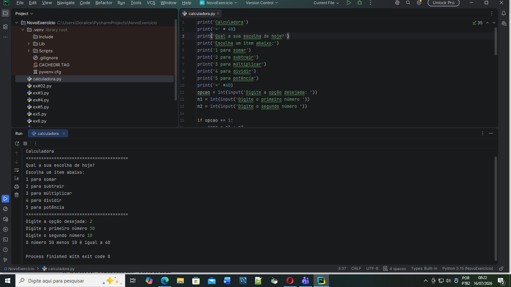

# Meus Projetos Python

Olá! Eu sou a Dora, estudante de Análise e Desenvolvimento de Sistemas e apaixonada por tecnologia.

Este repositório reúne os exercícios e projetos que desenvolvo durante meus estudos de Python, utilizando cursos como Curso em Vídeo, Udemy e os conteúdos da faculdade.

Atualmente estou construindo minha base em programação, praticando lógica, algoritmos e desenvolvimento de software. Meu objetivo é evoluir constantemente, desenvolver projetos cada vez mais completos e conquistar uma oportunidade de estágio na área de tecnologia.

Aqui você encontrará minha jornada de aprendizado, meus desafios e a evolução dos meus conhecimentos em Python.

## 1 - Classificação de Atletas

Programa que recebe a idade do atleta e o classifica nas categorias: Mirim, Infantil, Júnior, Sênior ou Master.

**O que eu aprendi:** while, if/else, random e lógica de repetição.

## 2 - Cotação do Dólar

Programa que converte valores em reais para dólares.

**O que eu aprendi:** input, float, f-strings e cálculos matemáticos.

## 3 - Financiamento da Casa

Programa que verifica se um financiamento imobiliário pode ser aprovado.

**Regra:** a prestação não pode ultrapassar 30% do salário do comprador.

**O que eu aprendi:** cálculos, lógica de negócio e estruturas condicionais.

## 4 - Jogo de Adivinhação

Um jogo interativo em que o computador escolhe um número aleatório e o usuário precisa adivinhar.

**O que eu aprendi:** if, elif, else e estruturas de decisão.

## 5 - Média do Aluno

Calcula a média de duas notas e informa se o aluno está aprovado, em recuperação ou reprovado.

**O que eu aprendi:** operações matemáticas e condicionais.

## 6 - Analisando Triângulos

Programa que analisa três segmentos e verifica se eles podem formar um triângulo. Em seguida, classifica o triângulo como Equilátero, Isósceles ou Escaleno.

**O que eu aprendi:** a importância da ordem das condições para o funcionamento correto do código.

## 7 - Índice de Massa Corporal (IMC)

Projeto voltado para saúde e bem-estar.

**O que ele faz:** solicita o peso e a altura do usuário, calcula o IMC e informa em qual faixa de classificação a pessoa se encontra.

**O que eu aprendi:** a utilizar vários elif em sequência e compreender a importância da ordem das condições.

## 8 - Calculadora

Calculadora simples desenvolvida em Python que permite ao usuário escolher entre diferentes operações matemáticas.

**Operações disponíveis:**

* Soma
* Subtração
* Multiplicação
* Divisão
* Potenciação

**O que eu aprendi:** utilização de variáveis, entrada de dados com input, operadores matemáticos, estruturas condicionais (if, elif e else) e tratamento de divisão por zero. Obs: ## Exemplo de execução

---

Feito com ❤️ por DorabellaAlice.
